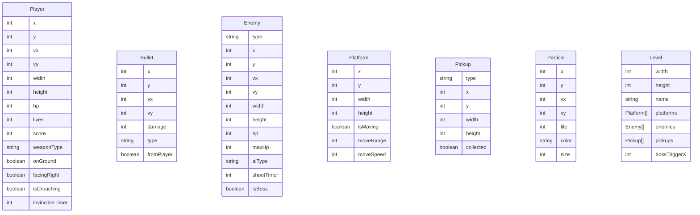

## 1. 架构设计

```mermaid
flowchart TD
    "浏览器" --> "React应用"
    "React应用" --> "游戏引擎层"
    "游戏引擎层" --> "物理引擎"
    "游戏引擎层" --> "关卡系统"
    "游戏引擎层" --> "实体系统"
    "游戏引擎层" --> "武器系统"
    "游戏引擎层" --> "敌人AI"
    "游戏引擎层" --> "粒子系统"
    "游戏引擎层" --> "相机系统"
    "React应用" --> "Canvas渲染器"
    "React应用" --> "HUD组件"
    "React应用" --> "触控控制"
    "React应用" --> "localStorage"
```

## 2. 技术说明
- 前端：React@18 + TailwindCSS@3 + Vite
- 初始化工具：Vite
- 后端：无（纯前端单机游戏）
- 数据存储：localStorage（最高分、游戏设置）
- 渲染：HTML5 Canvas 2D（像素风渲染 + requestAnimationFrame 游戏循环）
- 物理引擎：自研轻量级AABB碰撞检测 + 重力系统

## 3. 路由定义

| 路由 | 用途 |
|------|------|
| / | 主菜单页面 |
| /game | 游戏主页面 |
| /gameover | 游戏结束页面 |

## 4. API定义
不适用（纯前端，无后端API）

## 5. 服务端架构图
不适用（纯前端项目）

## 6. 数据模型

### 6.1 数据模型定义



### 6.2 数据定义

核心游戏状态使用 Zustand 管理：

- **GameState**: 包含玩家、子弹列表、敌人列表、粒子列表、关卡数据、相机位置、游戏阶段、分数
- **Player**: 位置+速度+尺寸，生命值/命数，当前武器，朝向，地面检测，无敌时间
- **Bullet**: 位置+速度，伤害值，类型（普通/散弹/激光/火焰），归属（玩家/敌人）
- **Enemy**: 位置+速度+尺寸，HP，AI类型（巡逻/射击/飞行/固定炮台），射击计时器
- **Level**: 关卡宽度，平台数组，敌人配置，道具配置，Boss触发位置
- **ScoreRecord**: localStorage 存储格式 `{ highestScore: number, highestLevel: number, totalGames: number }`

### 6.3 游戏循环架构

使用 requestAnimationFrame 驱动固定时间步长游戏循环：
1. 处理输入 → 2. 更新物理 → 3. 更新AI → 4. 碰撞检测 → 5. 更新粒子 → 6. 更新相机 → 7. 渲染
