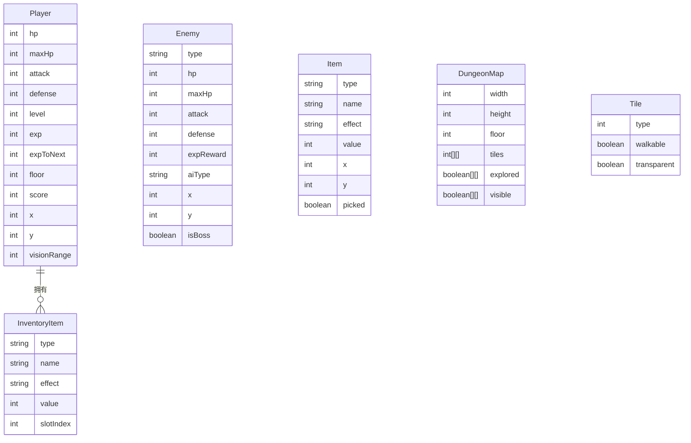

## 1. 架构设计

```mermaid
flowchart TD
    "浏览器" --> "React应用"
    "React应用" --> "游戏引擎层"
    "游戏引擎层" --> "地牢生成器"
    "游戏引擎层" --> "实体系统"
    "游戏引擎层" --> "战斗系统"
    "游戏引擎层" --> "物品系统"
    "游戏引擎层" --> "AI系统"
    "游戏引擎层" --> "迷雾系统"
    "游戏引擎层" --> "回合管理器"
    "React应用" --> "Canvas渲染器"
    "React应用" --> "HUD组件"
    "React应用" --> "消息日志"
    "React应用" --> "触控控制"
    "React应用" --> "localStorage"
```

## 2. 技术说明
- 前端：React@18 + TailwindCSS@3 + Vite
- 初始化工具：Vite
- 后端：无（纯前端单机游戏）
- 数据存储：localStorage（最高分、游戏设置）
- 渲染：HTML5 Canvas 2D（像素风渲染）

## 3. 路由定义

| 路由 | 用途 |
|------|------|
| / | 主菜单页面 |
| /game | 游戏主页面 |
| /gameover | 游戏结束页面 |

## 4. API定义
不适用（纯前端，无后端API）

## 5. 服务端架构图
不适用（纯前端项目）

## 6. 数据模型

### 6.1 数据模型定义



### 6.2 数据定义

核心游戏状态使用 React Context + useReducer 管理：

- **GameState**: 包含玩家、敌人列表、物品列表、地图数据、消息日志、游戏阶段
- **DungeonMap**: 二维数组存储地砖类型（墙壁0/地板1/走廊2/门3/楼梯4），配合探索/可见布尔数组
- **Player/Enemy/Item**: 纯数据对象，由对应系统函数操作
- **ScoreRecord**: localStorage 存储格式 `{ highestFloor: number, highestScore: number, totalGames: number }`
